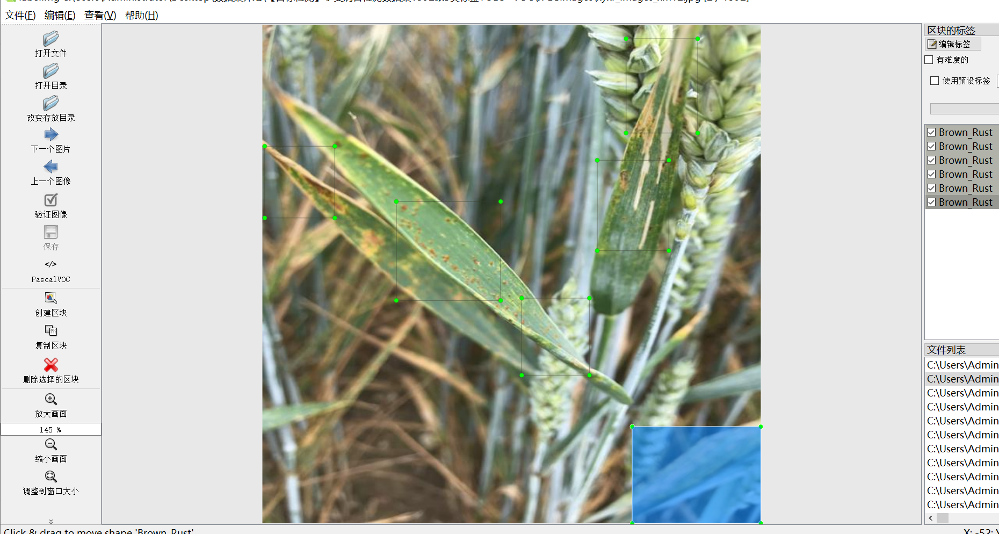
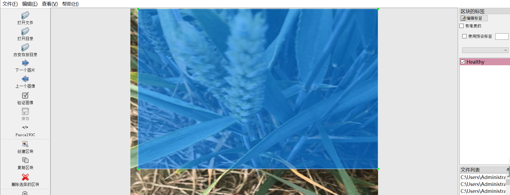
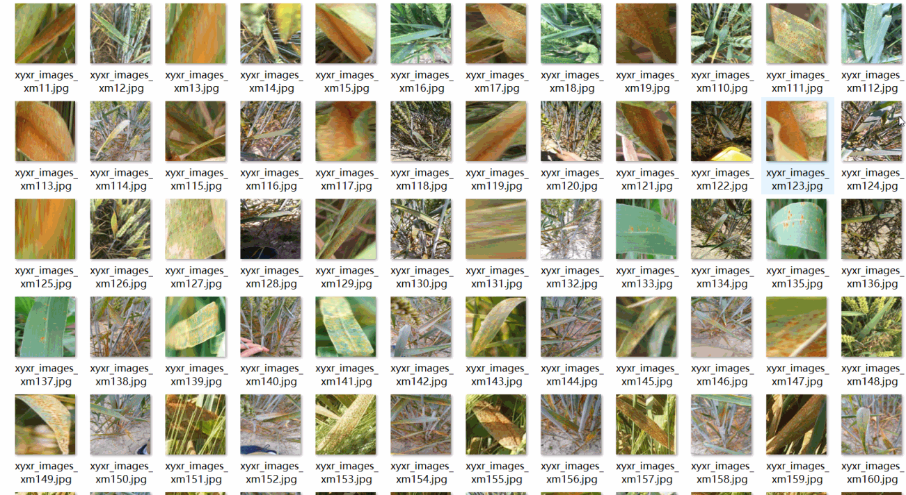
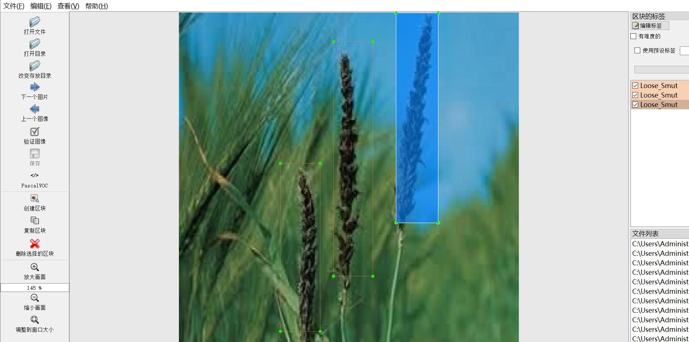

# [Object Detection] Wheat Disease Detection Dataset
1392 images, 5-class labels: YOLO+VOC

The dataset format is VOC with YOLO.

The zip file contains three folders, each storing images, xml, and txt files.

The JPEGImages folder contains a total of 1392 jpg images.

The Annotations folder contains a total of 1392 xml files.

The labels folder contains a total of 1392 txt files.

There are 5 types of labels: ["Brown_Rust", "Healthy", "Loose_Smut", "Septoria", "Yellow_Rust"]

The number of boxes for each label (Note that the order of categories in the YOLO format may not match this, but it is based on the classes.txt in the labels folder):

Brown_Rust boxes = 1273 (brown rust)

Healthy boxes = 260 (healthy)

Loose_Smut boxes = 456 (loose smut)

Septoria boxes = 1050 (shell bean)

Yellow_Rust boxes = 928 (wheat stripe)

Total boxes = 3967

The image resolution is clear.

The images are not enhanced.

The shape of the labels is rectangular boxes used for target detection recognition.

Important notes: No guarantees are made regarding the accuracy or weights of the trained models from this dataset. The dataset only provides accurate and reasonable annotations.

Image overview

## Images

---

Here is a pay link on Stripe (https://buy.stripe.com/3cs8yP7sY87d0vu9AB). Please contact me lonlonago@foxmail.com after funding $89, and I will send you a complete data files, thank you!

